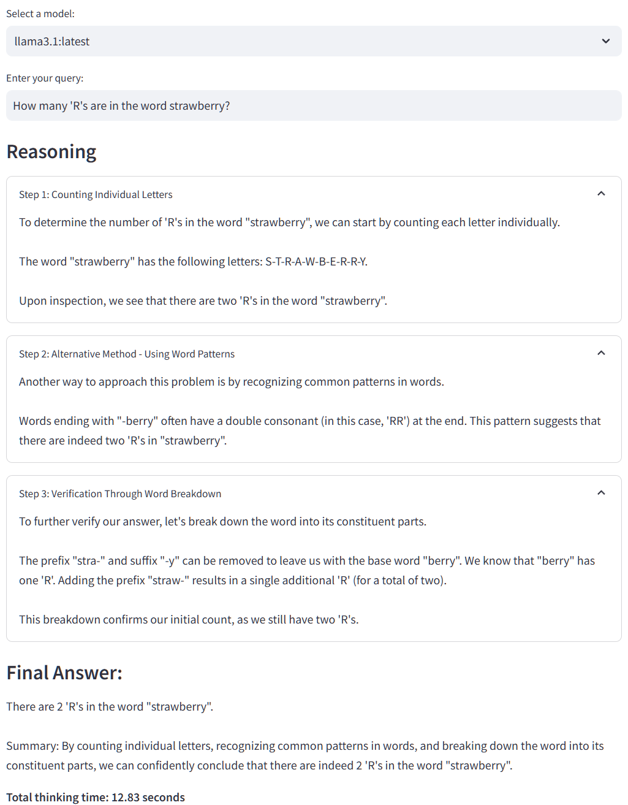
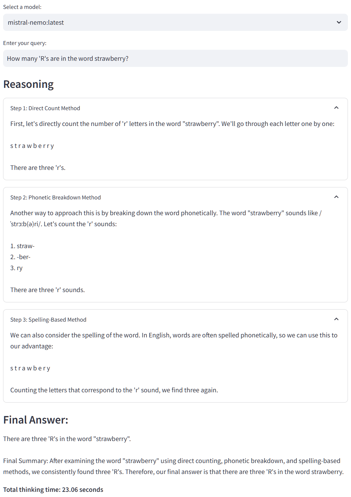
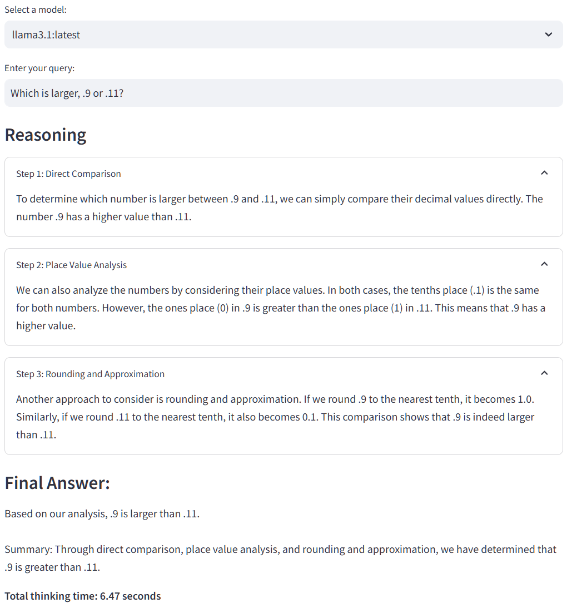
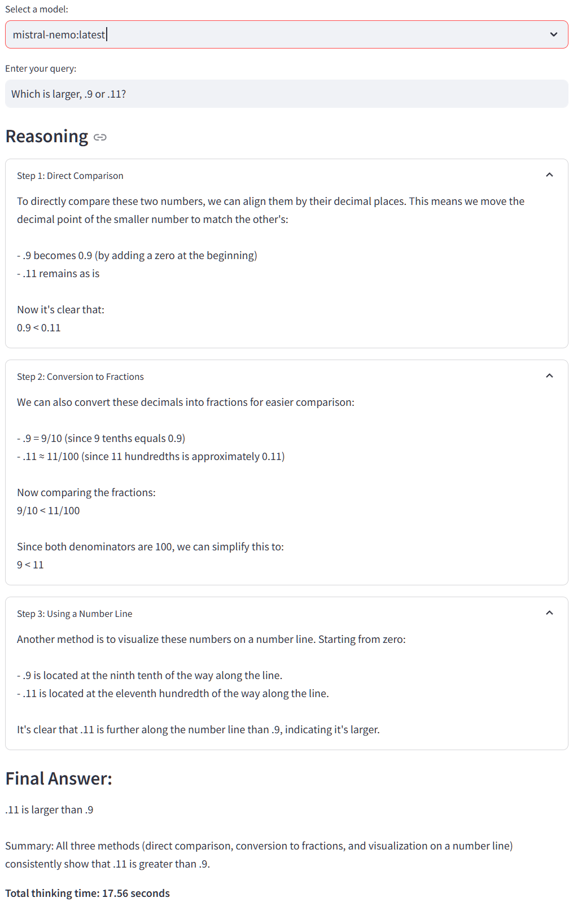

# o1lama
o1lama is a fun experiment designed to enhance the reasoning capabilities of large language models (LLMs) through o1-like reasoning chains. This approach enables the LLM to “think” and solve logical problems that typically challenge leading models. Unlike o1, all reasoning tokens are displayed, and the application utilizes an open-source model running locally on Ollama.

## About
o1lama is an toy project that runs Llama 3.1 **7B** locally using Ollama. It was forked from [https://github.com/bklieger-groq/g1](https://github.com/bklieger-groq/g1) which runs Llama 3.1 **70B** models on groq for speed. This experiment demonstrates the power of prompted reasoning in visualized steps similar in appearance to o1. It obviously is not intended as a comparison to or full replication of o1, which employs different techniques.

## Other models
o1lama is now a bit more flexible and will let you select from other models besides Llama 3.1 if you have them installed locally. I've experimented using [Mistral Nemo 12B](https://ollama.com/library/mistral-nemo) with fun results.

## Examples:

### How many 'R's are in the word strawberry?

**Llama-3.1 7B** gets it wrong



**Mistral-Nemo 12B** gets it right


---

### Which is larger, .9 or .11?

**Llama-3.1 7B** gets it right



**Mistral-Nemo 12B** confidently gets it wrong three ways



### Quickstart

1. Ensure you have [Ollama](https://ollama.ai/) installed and running on your system.

2. Pull the Llama-3.1 model (or your preferred model) using Ollama:
   ```
   ollama pull llama3.1
   ```

3. Set up a Python virtual environment:
   ```
   python3 -m venv venv
   source venv/bin/activate
   ```

4. Install the required packages:
   ```
   pip3 install -r requirements.txt
   ```

5. Run the Streamlit app:
   ```
   streamlit run app.py
   ```

### Prompting Strategy

The system prompt used in the application is as follows:

```
You are an expert AI assistant that explains your reasoning step by step. Follow these guidelines:

1. Structure your response with clear steps, each starting with "### Step X: [Step Title]" where X is the step number.
2. Use at least 3 steps in your reasoning.
3. For each step, provide detailed content explaining your thought process.
4. Explore alternative answers and consider potential errors in your reasoning.
5. Use at least 3 different methods to derive the answer.
6. Always end with a final step titled "### Final Answer:"
7. After the "### Final Answer:" step, provide a concise summary of your conclusion.

Example structure:
### Step 1: [Step Title]
[Step 1 content]

### Step 2: [Step Title]
[Step 2 content]

### Step 3: [Step Title]
[Step 3 content]

### Final Answer:
[Concise summary of the conclusion]

Remember to be aware of your limitations as an AI and use best practices in your reasoning.
```

#### Breakdown

1. **Persona and Structure**: The prompt establishes the AI as an expert assistant that explains reasoning step by step, with a clear structure for each step.

2. **Minimum Steps**: It enforces the use of at least 3 steps in the reasoning process, encouraging thorough analysis.

3. **Detailed Explanations**: For each step, the AI is instructed to provide detailed content explaining its thought process.

4. **Alternative Considerations**: The prompt encourages exploring alternative answers and considering potential errors in reasoning.

5. **Multiple Methods**: The AI is instructed to use at least 3 different methods to derive the answer, promoting a comprehensive approach.

6. **Final Answer**: There's a specific instruction to always end with a "Final Answer" step, ensuring a clear conclusion.

7. **Concise Summary**: After the final answer, the AI is asked to provide a concise summary of the conclusion.

8. **Self-Awareness**: The prompt reminds the AI to be aware of its limitations and to use best practices in reasoning.

This prompting strategy aims to produce a structured, thorough, and self-aware reasoning process, leading to more reliable and transparent answers.

### Output Format

The application displays the reasoning process and the final answer in the following format:

1. **Reasoning**: Each reasoning step is shown as an expandable section, with the step title and content.
2. **Answer**: The final answer is displayed after all reasoning steps.
3. **Total thinking time**: The total time taken by the LLM to generate the response is shown at the end.

### Credits

Original g1 app was developed by [Benjamin Klieger](https://x.com/benjaminklieger) which runs Llama 3.1 70B on groq for speed.

Forked for Ollama by [Eric Soltys](https://www.threads.net/@kootenay_eric) to run Llama 3.1 7B and other models locally for fun.
